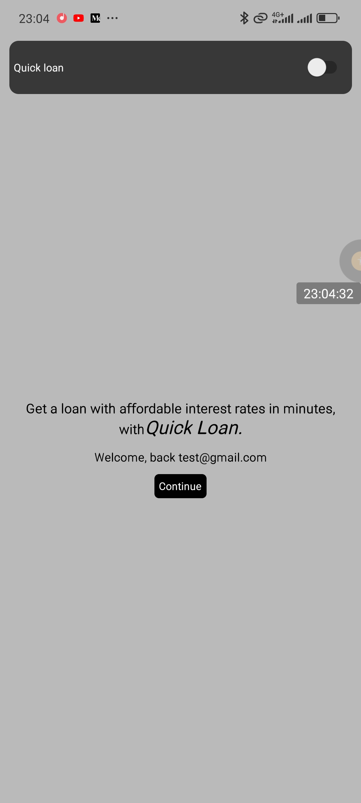
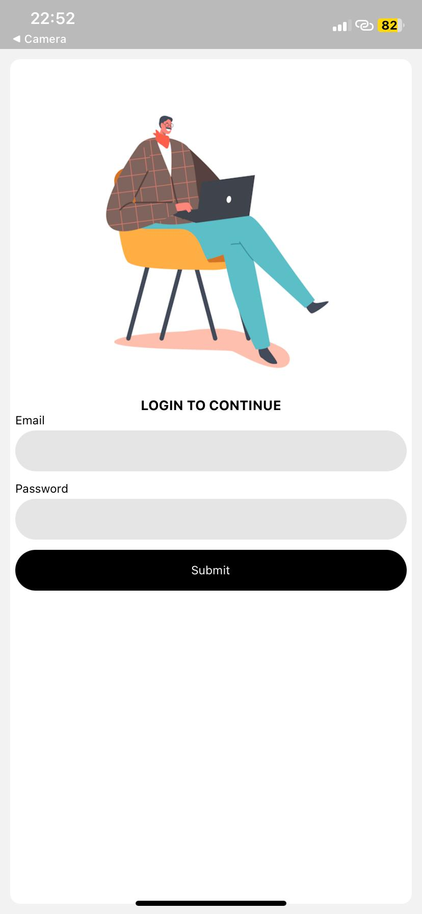
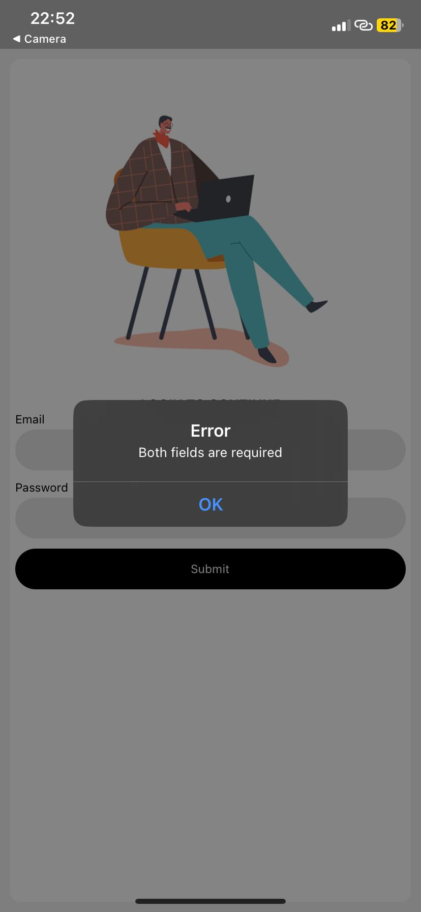
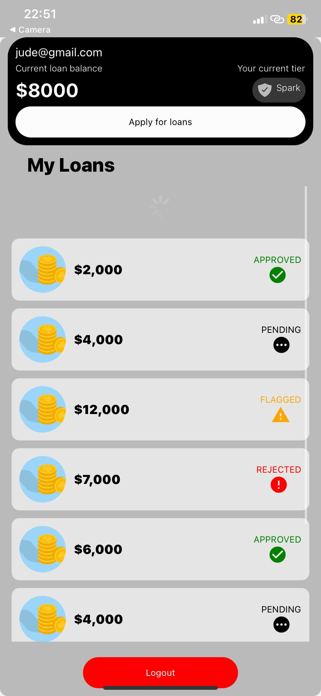
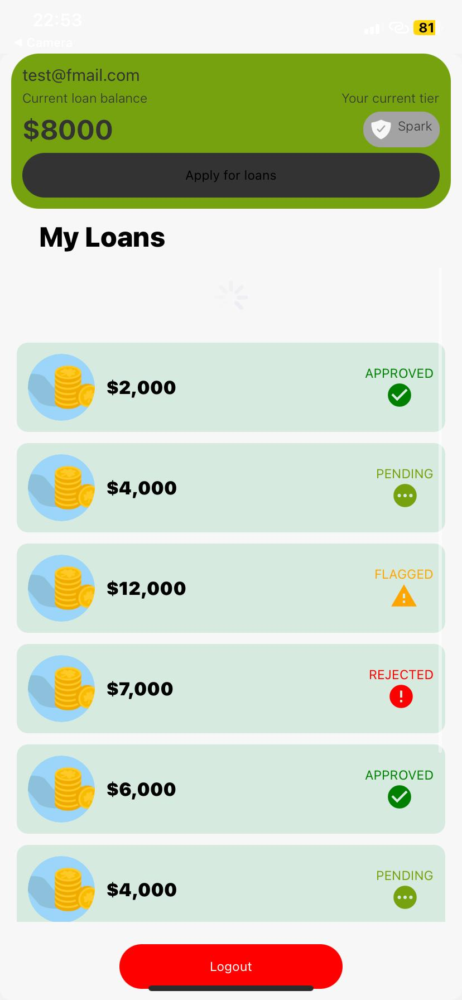
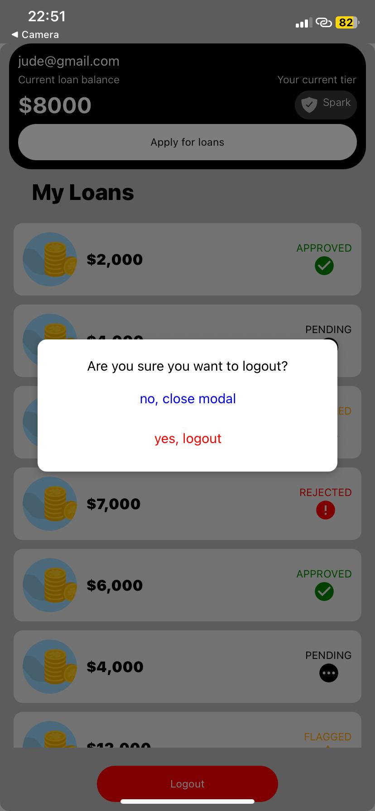
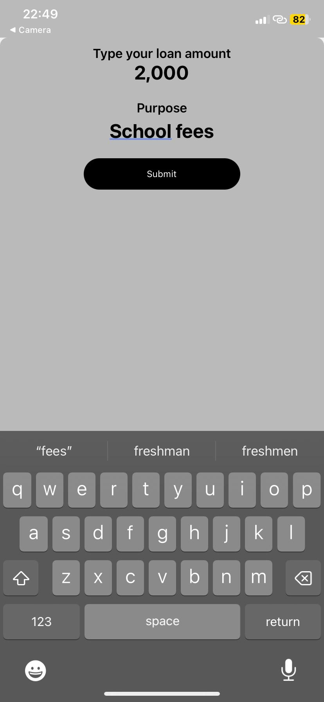
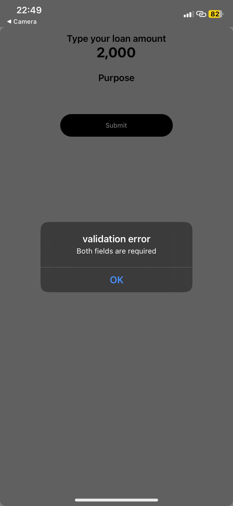
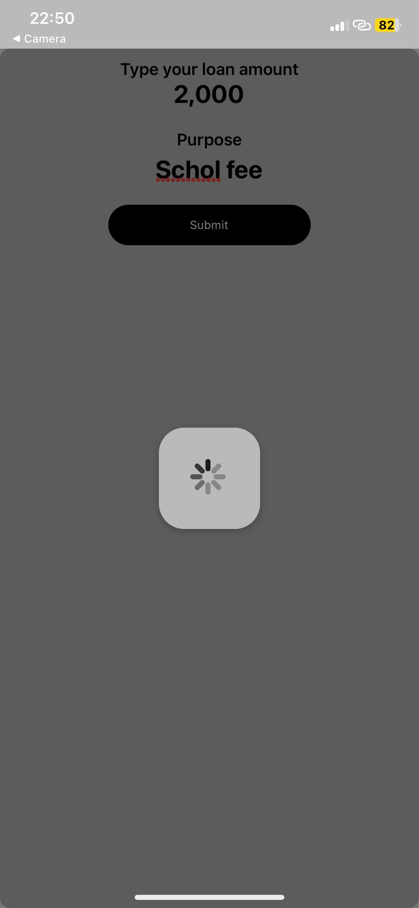
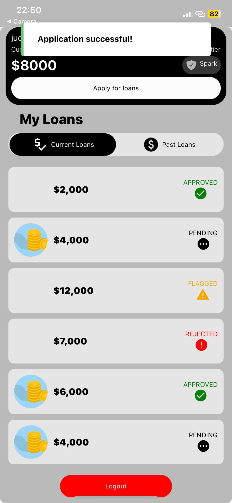

# Welcome to my Mock loan Expo app

## Get started

1. Clone the repo

   ```bash
   git clone https://github.com/Moluno-xiii/expo_loan_app.git
   ```

2. Install dependencies

   ```bash
   pnpm install
   ```

3. Start the app

   ```bash
   pnpm start
   ```

4. Install 'Expo go' app on your Android or Ios device.
5. Scan the QR code on the command line when you ran the app with 'pnpm start' on the installed Expo go app (on Android) and with your camera (on IOS).

## App Images














## Assumptions i made.

- I mocked all data fetching from locally stored json.
- Normally, it would be done in a number of ways (tanstack query, swr, graphQL apollo).
- I added timeouts to all data fetching, mutation functions to simulate real fetching mutation ( show the loading spinner).
- I put most of the components styling inside the component itself, normally it would be put in separate files for readability, but in this case, the code is still readable because the codebase is lightweight.
- Handled user's auth data with context instead of redux / zustand because it suits this case (lightweight and doesn't change frequently) since any change on any context value from any component causes all components consuming the context to rerender.
- Put the logout button on the home screen even though it's bad practice, normally would put it in another screen (settings or profile) i went this way since it's just for testing purposes.
